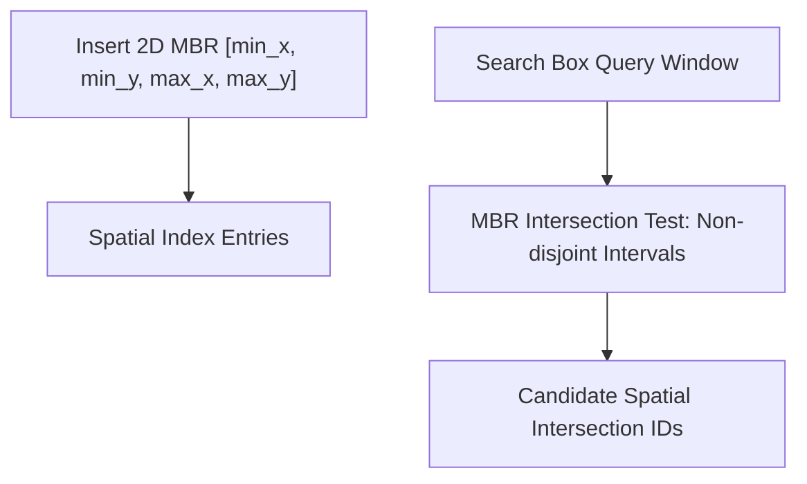

# R-Tree Spatial Indexing Skill

Hierarchical bounding volume spatial indexing engine for fast 2D range searching and geometric collision detection.

## Features
- **100% Python Standard Library**: No external spatial C-libraries.
- **Fast Bounding Box Filtering**: Sublinear spatial query efficiency.
